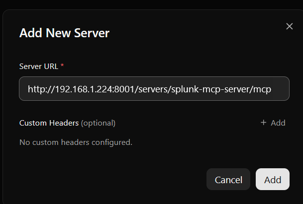
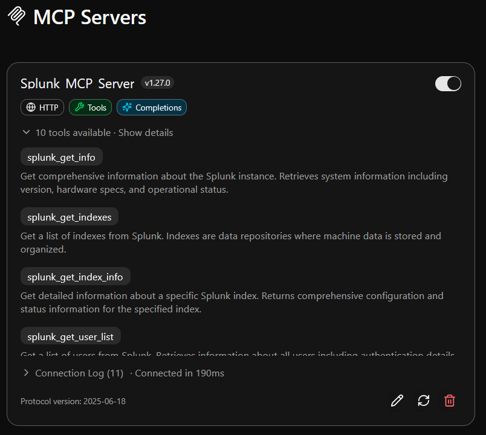
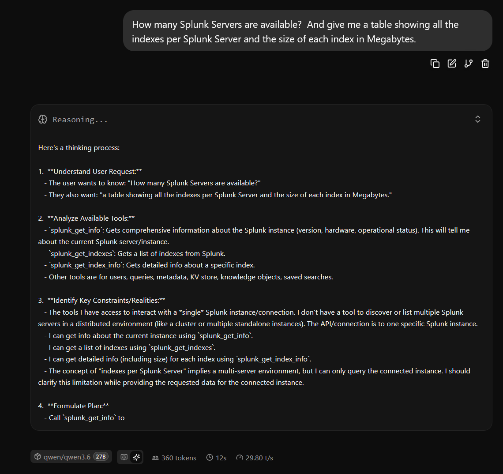
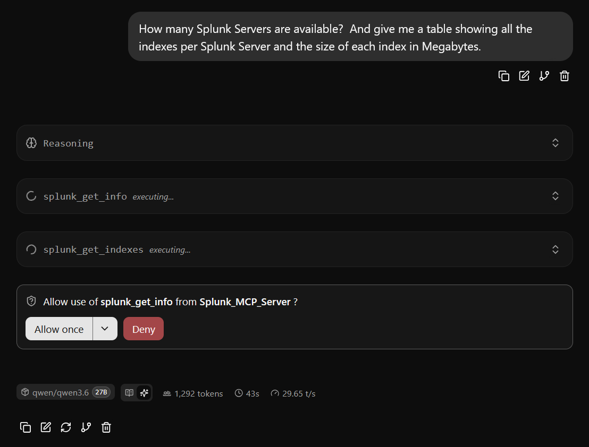
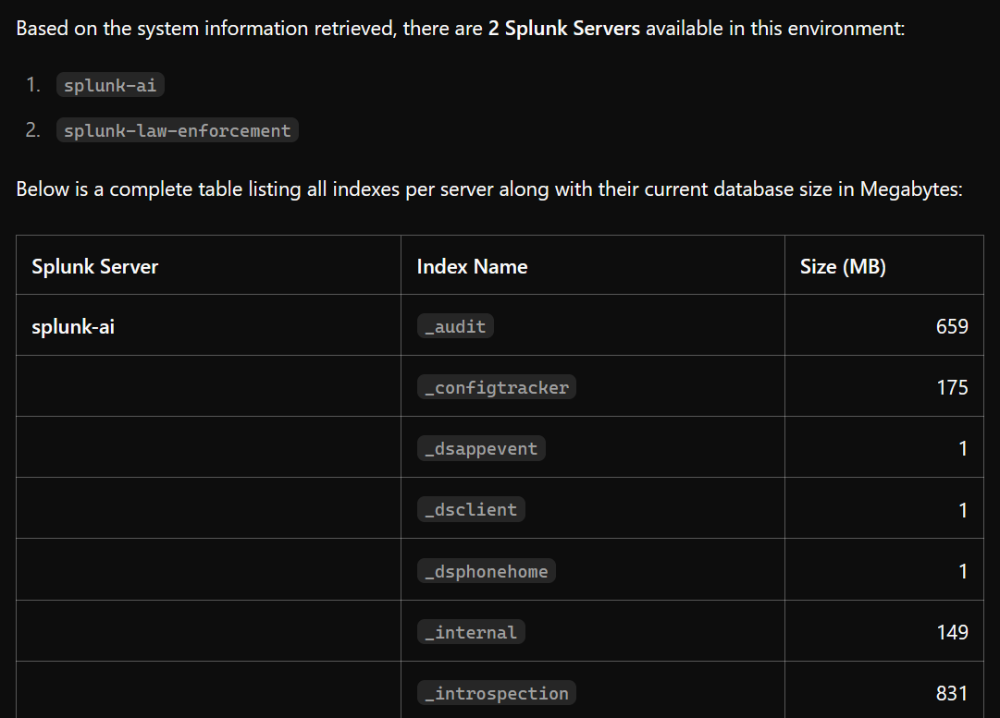
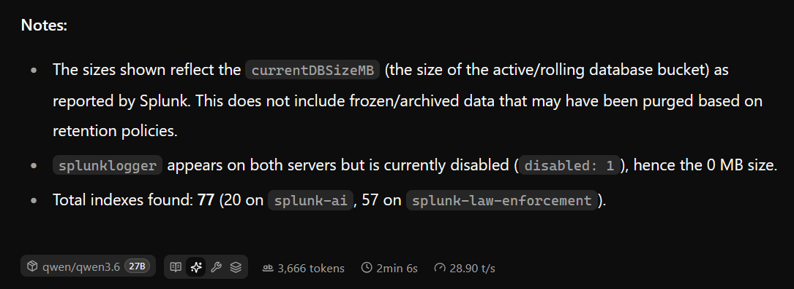

# mpc-proxy-for-splunk

Give llama.cpp's `llama-server` the ability to query Splunk via MCP (Model Context Protocol) by routing requests through a lightweight Python bridge and an MCP proxy.

If your AI Agent or LLM inference client only needs access to one MCP server, then this may not be for you.  If you have multiple MCP servers and need a MCP proxy for ease of use, management and security(ish) then this may help.

Copy and pasting the MCP server JSON config from Splunk MCP server will not work with all LLM inference engines, so this was created to help remove the friction of using LLM inference engines like llama.cpp.  

[MCP Proxy](https://github.com/sparfenyuk/mcp-proxy) is used to funnel MCP requests into a single endpoint from a LLM inference service/client. 

`config.json` has a sample MCP Server configuration that was used for testing.  Remove MCP server you do not want or need.  Recommend keeping the Time MCP server as some LLMs don't understand time and are trained to use their internal knowledge of time events.  


>    May 7, 2026 21:32:07 **User**: Tell me how many failed logins we had on the domain controller back in January. 

>    May 7, 2026 21:32:09 **LLM**: ... (Checks January 2024) ... 

Smaller and/or older LLMs struggle with time awareness and will use its last known date of traning for "current time".  
If you see poor results with the LLM understanding time:
1. Add "Always check the current time and date at the start of your conversation." to your system prompt or ask at the beginning of the conversation
2. Find a LLM that can one-shot a SPL search understanding time variables.
3. Create a Splunk Skill that the LLM can undestand that looks for the most recent events in an index.

---

## Table of Contents

- [How It Works](#how-it-works)
- [Files](#files)
- [Key Code](#key-code)
  - [`splunk_bridge.py` — `main()`](#splunk_bridgepy--main)
  - [`config.json` — MCP server registry](#configjson--mcp-server-registry)
  - [`start_mcp_proxy.sh`](#start_mcp_proxysh)
- [How-To](#how-to)
  - [Prerequisites](#prerequisites)
  - [Step 1 — Configure the bridge](#step-1--configure-the-bridge)
  - [Step 2 — (Optional) Adjust the server registry](#step-2--optional-adjust-the-server-registry)
  - [Step 3 — Start the proxy](#step-3--start-the-proxy)
  - [Step 4 — Point llama-server at the proxy](#step-4--point-llama-server-at-the-proxy)
  - [Step 5 — Add MCP Servers to llama-server Web UI](#step-5--add-mcp-servers-to-llama-server-web-ui)
  - [Step 6 — Verify end-to-end](#step-6--verify-end-to-end)
- [Troubleshooting](#troubleshooting)
- [Results](#results)
- [License](#license)

---

## How It Works

```
llama-server (llama.cpp)
       │
       │  MCP / JSON-RPC over HTTP
       ▼
mcp-proxy  (port 8001)           ← start_mcp_proxy.sh
       │
       │  stdin / stdout (JSON-RPC lines)
       ▼
splunk_bridge.py                 ← config.json wires this in
       │
       │  HTTPS POST  (Bearer token)
       ▼
Splunk MCP endpoint  :8089/services/mcp
```

`llama-server` speaks to `mcp-proxy` over HTTP on port 8001. `mcp-proxy` routes each request to the appropriate backend defined in `config.json`. For Splunk, that backend is `splunk_bridge.py`, a stdin/stdout process that:

1. Reads a JSON-RPC request line from stdin.
2. Posts it to Splunk's MCP REST endpoint with a Bearer token.
3. Unwraps Splunk's `{"payload": …}` envelope.
4. Writes the inner payload back to stdout for `mcp-proxy` to return to `llama-server`.

`mcp-proxy` also exposes three optional helper servers (time, web fetch, DuckDuckGo search) registered in the same `config.json`.

---

## Files

| File | Role |
|------|------|
| [`splunk_bridge.py`](splunk_bridge.py) | Core bridge — proxies JSON-RPC ↔ Splunk HTTP |
| [`config.json`](config.json) | MCP server registry consumed by `mcp-proxy` |
| [`start_mcp_proxy.sh`](start_mcp_proxy.sh) | Startup script — launches `mcp-proxy` on port 8001 |

---

## Key Code

### `splunk_bridge.py` — `main()`

**Session setup (lines 14–19):** Creates a persistent `requests.Session` with the Bearer token and JSON content-type headers.

```python
session.headers.update({
    "Authorization": f"Bearer {TOKEN}",
    "Content-Type": "application/json",
    "Accept": "application/json, text/event-stream"
})
```

**Request loop (lines 21–54):** Reads newline-delimited JSON from stdin indefinitely.

```python
for line in sys.stdin:
    mcp_request = json.loads(line)
    response = session.post(URL, json=mcp_request, verify=False)
```

**Payload unwrapping (lines 31–38):** Splunk wraps its response in `{"payload": …}`. The bridge strips that wrapper before writing to stdout.

```python
if isinstance(resp_json, dict) and "payload" in resp_json:
    payload = resp_json["payload"]
    print(payload if isinstance(payload, str) else json.dumps(payload), flush=True)
```

**Error responses (lines 42–50):** On non-200 responses the bridge emits a well-formed JSON-RPC error so `llama-server` gets a structured failure instead of silence.

```python
error_resp = {
    "jsonrpc": "2.0",
    "id": mcp_request.get("id"),
    "error": {"code": -32603, "message": f"Splunk returned HTTP {response.status_code}: …"}
}
```

### `config.json` — MCP server registry

`mcp-proxy` reads this file to know how to launch each backend. The Splunk entry uses `uv run --with requests` so the `requests` library is injected at runtime without a separate install step.

```json
"splunk-mcp-server": {
  "command": "uv",
  "args": ["run", "--quiet", "--with", "requests", "splunk_bridge.py"]
}
```

The other three entries are optional convenience servers:

```json
"time":       { "command": "uvx", "args": ["mcp-server-time", "--local-timezone=America/New_York"] },
"fetch":      { "command": "uvx", "args": ["mcp-server-fetch"] },
"ddg-search": { "command": "uvx", "args": ["duckduckgo-mcp-server"] }
```

### `start_mcp_proxy.sh`

```bash
uvx mcp-proxy --named-server-config config.json \
              --host 0.0.0.0 \
              --allow-origin "*" \
              --port 8001 \
              --stateless 2>&1 | tee -a mcp-proxy.log
```

- `--named-server-config config.json` — loads the server registry.
- `--host 0.0.0.0` — allows all hosts to connect, change to IP as necessary for security
- `--allow-origin "*"` allows CORS from any domain, change as necessary for security
- `--port 8001` — the port `llama-server` connects to.
- `--stateless` — no session state is kept between requests.
- Output is appended to `mcp-proxy.log` for debugging.

---

## How-To

### Prerequisites

| Tool | Purpose |
|------|---------|
| `uv` / `uvx` | Runs Python scripts and MCP servers without manual installs |
| `mcp-proxy` | Multiplexes MCP requests across multiple backends |
| Python 3 | Required by `splunk_bridge.py` |
| Splunk ≥ 9.x with MCP enabled | Target data source (port 8089) |
| `llama-server` (llama.cpp) | The LLM frontend that issues MCP requests |

Install `uv` (includes `uvx`):

```bash
curl -Ls https://astral.sh/uv/install.sh | sh
```

### Step 1 — Configure the bridge

Open [`splunk_bridge.py`](splunk_bridge.py) and set your Splunk address and token at lines 10–11:

```python
URL   = "https://<your-splunk-host>:8089/services/mcp"
TOKEN = "<your-splunk-bearer-token>"
```

To generate a Bearer token in Splunk: **Settings → Tokens → New Token**.

### Step 2 — (Optional) Adjust the server registry

Open [`config.json`](config.json) if you want to:
- Change the timezone for the `time` server.
- Remove servers you do not need (e.g., `ddg-search`, `fetch`).
- Add additional MCP servers following the same `command`/`args` pattern.

### Step 3 — Start the proxy

```bash
chmod +x start_mcp_proxy.sh
./start_mcp_proxy.sh
```

The proxy logs to `mcp-proxy.log` in the same directory. Confirm it is running:

```bash
tail -f mcp-proxy.log
```

You should see lines like `Serving on http://0.0.0.0:8001`.

### Step 4 — Point llama-server at the proxy
Start `llama-server` with  `--webui-mcp-proxy`:
Example command:

```bash
llama.cpp/build/bin/llama-server \
    --<insert your other paramenters>
    --host 0.0.0.0 \
    --port 8084 \
    --webui-mcp-proxy \
```

`llama-server` will discover the available tools (including Splunk) via the MCP capability negotiation handshake and can then issue queries to Splunk through normal tool-call requests.


### Step 5 — Add MCP Servers to llama server Web UI

1. Open llama-server Web UI
2. Left Nav Column -> MCP Servers -> Add New Server
3. http://<MCP Proxy IP>:8001/servers/<MCP Server Name>/mcp



You must toggle the MCP Server to be enabled, off by default.


### Step 6 — Verify end-to-end

A successful Splunk MCP call will:
1. Appear in `mcp-proxy.log` as an inbound request routed to `splunk-mcp-server`.
2. Produce a JSON response (the unwrapped `payload`) written back on stdout of `splunk_bridge.py`.
3. Surface in `llama-server`'s output as a completed tool result.

---

## Troubleshooting

| Symptom | Likely cause | Fix |
|---------|-------------|-----|
| `401 Unauthorized` from Splunk | Wrong or expired token | Regenerate token in Splunk; update `TOKEN` in `splunk_bridge.py` |
| SSL warnings or connection errors | Self-signed Splunk cert | SSL verification is already disabled via `urllib3.disable_warnings` and `verify=False` |
| `mcp-proxy` not found | `uvx` not installed or not on PATH | Install `uv`; ensure `~/.local/bin` is in PATH |
| Bridge exits silently | Malformed JSON from `llama-server` | `json.JSONDecodeError` is caught and skipped; check `llama-server` MCP output |
| No Splunk results | MCP not enabled in Splunk | Enable the MCP feature in Splunk and confirm `/services/mcp` responds |

---
## Results
Screenshots:









## License

MIT — see [LICENSE](LICENSE).
